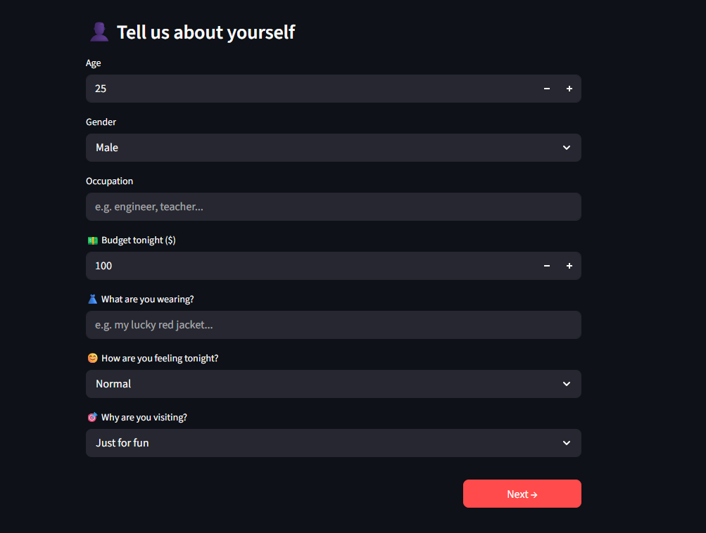
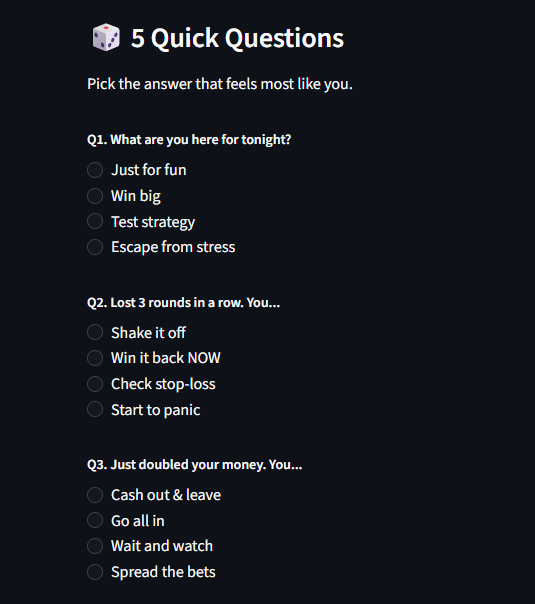
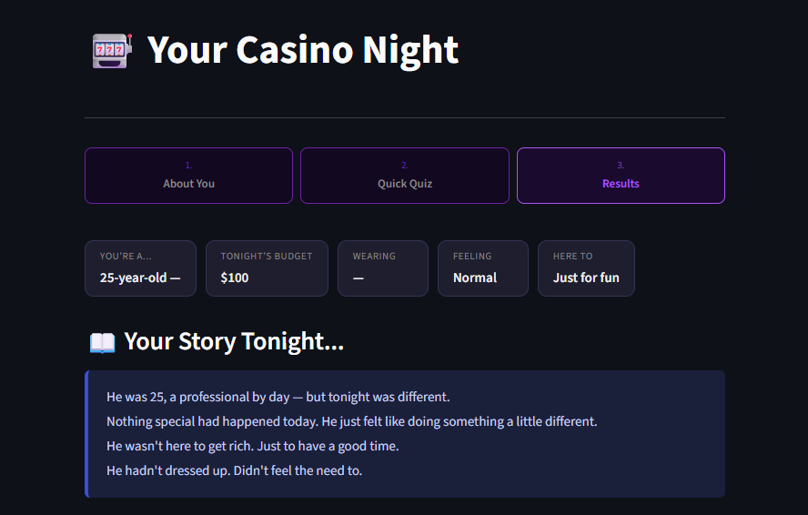
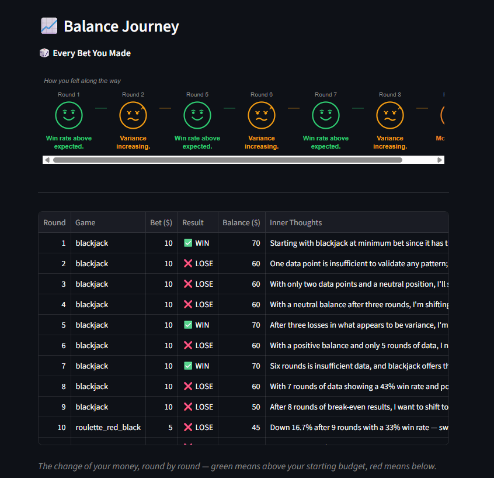
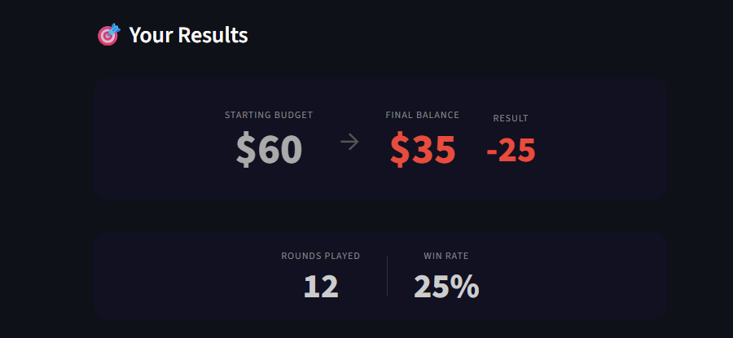
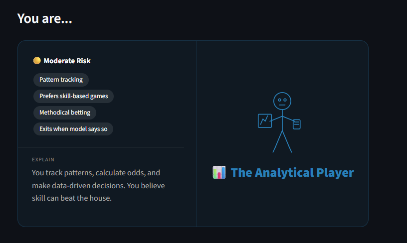
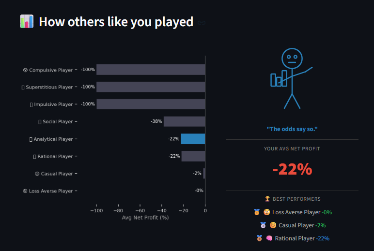
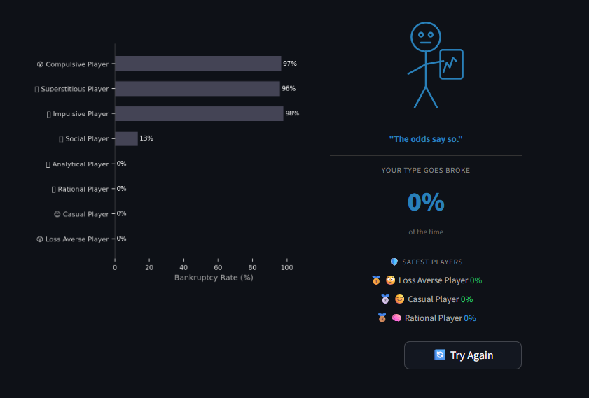

# 🎰 Casino Persona Simulator

<br>

> If AI can simulate how customers react to a new product — what else can it simulate?

<br>
Inspired by how ad companies use AI to model customer reactions, this project applies the same idea to human behavior — simulating 360 casino players across 8 personality types, each making real-time decisions and recording their inner thoughts every round.

**[Try the interactive quiz](https://casino-persona-simulator-pnhaymasntf2th9fr6ffpr.streamlit.app/)** — discover your casino persona


---

##  Business Problem


Can AI simulation reveal behavioral patterns that predict gambling risk — even without real-world data?


---

##  Business Value

| Description | Use Case |
|---|---|
|**Early Risk Identification** — identify at-risk players and intervene before harm escalates | casino |
|**No Real Data Needed** — a low-cost simulation tool for regulators and researchers | regulatory authority|
|**Transferable Framework** — same pipeline applicable to finance and trading to monitor investors or transactors | fintech/finance |
|**Educational Tool** — seeing someone with your own mindset go broke is more impactful than any warning label | education |

*Ironically, the casino industry itself may not be the most motivated adopter — but regulators, responsible gambling organizations, and mental health researchers might be.*

---

##  Key Findings

- **Persona determines fate, not luck** — bankruptcy rate ranges from 0% (Rational, Casual) to 98% (Impulsive), despite all players facing identical odds — confirming that behavioral patterns, not chance, drive outcomes
- **Specific phrases = danger signals** — rounds containing phrases like *"losses row"* showed **3.46x higher bets** and **8.3x higher bankruptcy risk** within 3 rounds
- **Safe language = safe outcomes** — players using phrases like *"stop loss"* had a **0% bankruptcy rate** within 3 rounds
- **Discipline > luck** — Rational players survived the longest (avg 104 rounds) while losing only 21.7%

---

## 8 Persona Types

| Persona | Risk Level | Key Trait |
|---|---|---|
| Casual | 🟢 Low | Here for fun, leaves early |
| Loss Averse | 🟢 Very Low | Minimum bets, leaves at first loss |
| Rational | 🟡 Moderate | Strict stop-loss and take-profit rules |
| Analytical | 🟡 Moderate | Pattern-tracking, skill-based games |
| Social | 🟠 Moderate-High | Atmosphere-driven, inconsistent bets |
| Impulsive | 🔴 High | Chases losses, emotionally driven |
| Superstitious | 🔴 High | Ritual-based, rarely leaves |
| Addicted | 🔴 Very High | Plays until broke, can't stop |

---
## 🏗 Architecture

**Data Generation** → **Analysis** → **Application**

- `games.py` + `simulation.py` + `Generate_all.py` — LLM Agent Simulation
- `Analysis.ipynb` — Behavioral Analysis, NLP, Clustering, Random Forest
- `app.py` — Streamlit Interactive App


---

##  Project Structure

```
casino-persona-simulator/
├── app.py                 # Streamlit interactive app
├── games.py               # Casino game logic (Blackjack, Roulette, Slots)
├── simulation.py          # AI agent simulation engine
├── Generate_all.py        # Data generation pipeline
├── Analysis.ipynb         # Full analysis & findings
├── data.csv               # Simulated dataset (360 players, 20,000+ rounds)
└── requirements.txt       # Dependencies
```

---

## Limitations

- **Synthetic data** — All behavioral and psychological data is AI-generated. The model learns patterns from simulated agents, not real humans — real behavior is far more complex and unpredictable.
- **Circular logic** — Personas are defined by behavioral rules, so the classifier partially learns these rules rather than discovering novel patterns; future work could validate against real-world data to test whether these patterns hold beyond the simulation.
- **Language gap** — NLP signals are derived from AI-generated reasoning; real-world application would require alternative data sources such as behavioral proxies or self-reported inputs.
- **Sample size** — 360 simulated players across 8 personas is a starting point, not a statistically robust dataset. Results should be interpreted with caution.
- **Overfitting** — Random Forest shows train-test gap (F1: 0.97 vs 0.80), suggesting the model may not generalize well to unseen personas or real-world data.

---

##  Future Work

- Technical aspect
   1. Validate against real-world data to improve model reliability
   2. Create more diverse personas to enrich simulation depth
   3. Improve agent prompts or switch models to make AI behavior closer to real humans

 
- Application aspect

  1. Transfer the framework to finance or investment scenarios
  2. Partner with regulatory authorities to pilot a responsible gambling intervention system
  3. Build a real-time monitoring system that alerts at-risk behavior as it happens

- Research aspect

   1. Statistically validate whether AI-simulated behavior mirrors real human behavior
   2. Explore other high-stress decision-making scenarios, such as medical triage or emergency response

*The ultimate goal is to validate this framework against real-world data — and expand it beyond casinos to any domain where understanding human behavior has significant value.*

---

##  How to Run

```bash
# Install dependencies
pip install -r requirements.txt

# Run the Streamlit app
streamlit run app.py
```

Add your Anthropic API key to a `.env` file:
ANTHROPIC_API_KEY=your_key_here


---

##  Links

- **Live App:** [Casino Persona Simulator](https://casino-persona-simulator-pnhaymasntf2th9fr6ffpr.streamlit.app/)
- **Full Analysis on GitHub:** [View on GitHub](./Analysis.ipynb)
- **Full Analysis on Google Colab:** [Open in Colab](https://drive.google.com/file/d/10ddebGg0JPlrG-v_Km30-Hm-fULNL6bW/view?usp=sharing) 


---

##  Interactive App

A quiz-based Streamlit app where you answer 5 questions and discover your casino persona — based on behavioral patterns from 360 AI-simulated players.

**How it works:**

**Step 1 — Tell us about yourself**
Fill in your profile: age, gender, occupation, budget, outfit, mood, and reason for visiting.



**Step 2 — Answer 5 behavioral questions**
- What are you here for tonight?
- You've lost 3 rounds in a row — what do you do?
- You just doubled your money — what's next?
- You're almost out of money — what do you do?
- How do you feel about luck tonight?



**Step 3 — See your results**
- Your personalized story tonight



- Balance journey chart



- Your result



- Your persona category



- How someone just like you played — round by round with inner thoughts




- Comparison - the bankruptcy rate and safest players ranking




---

##  About

Built by a MDSI student at UTS as a learning side project.
Inspired by how companies use AI to simulate customer reactions — applied to human decision-making.
Connect with me on [LinkedIn](https://www.linkedin.com/in/albee-tsai) .

*Still learning, still building — feedback always welcome!* 🙏
